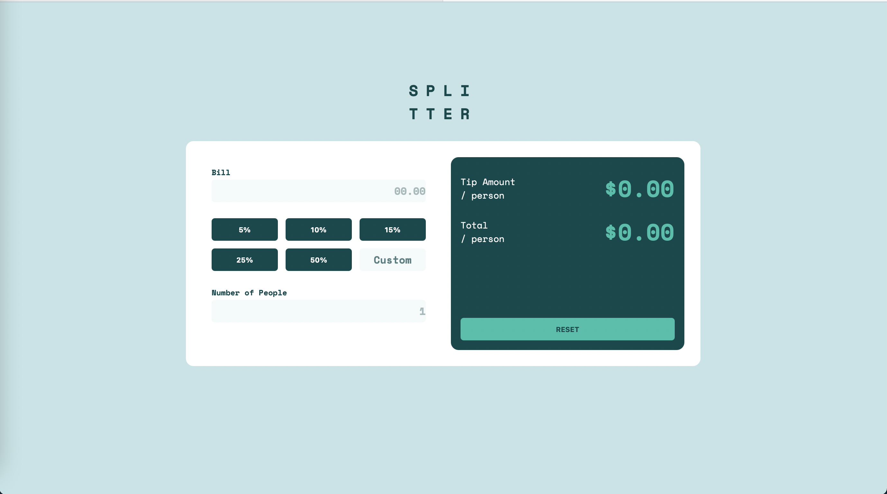

# Frontend Mentor - Tip calculator app solution

This is a solution to the [Tip calculator app challenge on Frontend Mentor](https://www.frontendmentor.io/challenges/tip-calculator-app-ugJNGbJUX). Frontend Mentor challenges help you improve your coding skills by building realistic projects.

## Table of contents

- [Overview](#overview)
  - [The challenge](#the-challenge)
  - [Screenshot](#screenshot)
  - [Links](#links)
- [My process](#my-process)
  - [Built with](#built-with)
  - [What I learned](#what-i-learned)
  - [Continued development](#continued-development)
  - [Useful resources](#useful-resources)
- [Author](#author)
- [Acknowledgments](#acknowledgments)

**Note: Delete this note and update the table of contents based on what sections you keep.**

## Overview

### The challenge

Users should be able to:

- View the optimal layout for the app depending on their device's screen size
- See hover states for all interactive elements on the page
- Calculate the correct tip and total cost of the bill per person

### Screenshot

### Links

- Solution URL: [GitHub Repository](https://github.com/Barbelitos/FrontEndMentor-TipCalculatorApp)
- Live Site URL: [Live Site](https://barbelitos.github.io/FrontEndMentor-TipCalculatorApp/)

## My process

### Built with

- HTML 5
- CSS
- Flexbox
- CSS Grid
- JavaScript

### What I learned

Really useful challenge to improve JavaScript skills.

### Continued development

### Useful resources

## Author

- GitHub - [@Barbelitos](https://github.com/Barbelitos)
- Frontend Mentor - [@Barbelitos](https://www.frontendmentor.io/profile/Barbelitos)

## Acknowledgments
